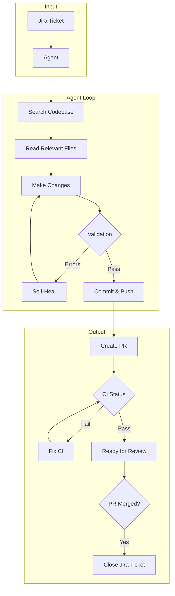

# Jira Agent

An autonomous agent that processes Jira tickets and implements code changes using Claude Opus 4.5.

## Features

- **Autonomous Code Changes**: Analyzes Jira tickets and implements required changes
- **Interactive CLI**: Browse tickets with arrow keys and select which to process
- **Multi-Repository Support**: Configure the agent to work with any GitHub repository
- **dbt Integration**: Special support for dbt model changes with dependency tracking
- **PR Automation**: Creates pull requests following repository conventions
- **CI Response**: Automatically fixes CI failures when possible
- **Watch Mode**: Poll for tickets and auto-close them when PRs merge
- **Automatic Ticket Closure**: Transitions Jira tickets to "Done" when PRs are merged

> **Deep Dive**: See [docs/HOW_IT_WORKS.md](docs/HOW_IT_WORKS.md) for detailed documentation on the agent's architecture, prompt engineering, and agentic loop.

---

## How It Works



**Key Steps:**
1. **Fetch Ticket** - Get requirements from Jira
2. **Search & Read** - Find relevant files (minimal reads to save context)
3. **Make Changes** - Edit files to implement the ticket
4. **Self-Heal** - Automatically fix validation errors (formatting, compile errors)
5. **Create PR** - Push changes and open pull request
6. **Fix CI** - If CI fails, analyze and fix (run formatters, fix code)
7. **Close Ticket** - When PR merges, transition Jira ticket to Done

---

## Prerequisites

Before installing the Jira Agent, ensure you have the following:

### Required

| Requirement | Version | Installation |
|-------------|---------|--------------|
| **Python** | 3.11+ | [python.org](https://www.python.org/downloads/) or `brew install python@3.11` |
| **Poetry** | 1.5+ | `curl -sSL https://install.python-poetry.org \| python3 -` or `brew install poetry` |
| **Git** | 2.0+ | `brew install git` (usually pre-installed) |

### Recommended

| Requirement | Purpose | Installation |
|-------------|---------|--------------|
| **GitHub CLI (gh)** | Auto-detect GitHub token | `brew install gh` then `gh auth login` |
| **pipx** | Global CLI installation | `brew install pipx` |

### API Access Required

| Service | What You Need |
|---------|---------------|
| **Anthropic** | API key from [console.anthropic.com](https://console.anthropic.com/) |
| **Jira** | OAuth 2.0 app (see [Jira OAuth Setup](#jira-oauth-setup)) |
| **GitHub** | Either `gh` CLI auth OR a Personal Access Token |

---

## Installation

### Quick Install (Recommended)

Install directly from GitHub using pipx:

```bash
# Install pipx if you haven't
brew install pipx  # macOS
# or: apt install pipx  # Ubuntu/Debian
# or: pip install --user pipx  # Other

pipx ensurepath  # Add pipx binaries to PATH (restart shell after)

# Install jira-agent
pipx install git+https://github.com/djayatillake/jira-agent.git

# Verify installation
jira-agent --help
```

To upgrade to the latest version:
```bash
pipx upgrade jira-agent
```

### Development Install

For contributing or modifying the code:

```bash
# Clone the repository
git clone https://github.com/djayatillake/jira-agent.git
cd jira-agent

# Install dependencies
poetry install

# Run via poetry
poetry run jira-agent --help

# Or activate poetry shell for direct commands
poetry shell
jira-agent --help
```

### Initial Setup

After installation, run the interactive setup:

```bash
jira-agent init
```

This will:
1. Check for required credentials (Anthropic API key, GitHub token, Jira OAuth)
2. Prompt you to enter any missing credentials (stored securely in your system keyring)
3. Create a `.jira-agent.yaml` config file in your repository

#### Environment Variables (Alternative)

You can also configure credentials via environment variables:

```bash
# ===========================================
# REQUIRED
# ===========================================

# Anthropic API Key (get from https://console.anthropic.com/)
ANTHROPIC_API_KEY="sk-ant-..."

# Jira OAuth Credentials (see "Jira OAuth Setup" section below)
JIRA_AGENT_JIRA_OAUTH_CLIENT_ID="your-client-id"
JIRA_AGENT_JIRA_OAUTH_CLIENT_SECRET="your-client-secret"

# ===========================================
# GITHUB (choose one method)
# ===========================================

# Method 1: Use gh CLI (RECOMMENDED - no env var needed!)
# Just run: gh auth login
# The agent will automatically use your gh CLI token.

# Method 2: Set token manually (only if not using gh CLI)
# JIRA_AGENT_GITHUB_TOKEN="ghp_..."

# ===========================================
# OPTIONAL
# ===========================================

# Databricks (if your repo uses dbt with Databricks)
# JIRA_AGENT_DATABRICKS_HOST="https://your-workspace.databricks.com"
# JIRA_AGENT_DATABRICKS_TOKEN="dapi..."

# Webhook server secret (for production webhook validation)
# JIRA_AGENT_WEBHOOK_SECRET="your-secret"

# Logging level (DEBUG, INFO, WARNING, ERROR)
# JIRA_AGENT_LOG_LEVEL="INFO"

# Workspace directory (where repos are cloned)
# JIRA_AGENT_WORKSPACE_DIR="/tmp/jira-agent"
```

### Step 4: Authenticate

```bash
# Authenticate with all services
jira-agent auth login

# Or authenticate individually
jira-agent auth login --service=jira
jira-agent auth login --service=github

# Check authentication status
jira-agent auth status
```

Expected output:
```
Authentication Status
========================================
Jira:       ✓ Authenticated
GitHub:     ✓ Authenticated (via gh CLI or env)
Databricks: ✗ Not configured
```

### Step 5: Verify Setup

```bash
# Run health check to verify all connections
jira-agent health --config configs/your-repo.yaml
```

Expected output:
```
Health Check
==================================================
Config: your-org/your-repo

Anthropic API:
  Status: OK
  Model configured: claude-opus-4-5-20251101

Jira:
  Status: OK
  Accessible sites: 1
    - your-org (https://your-org.atlassian.net)
  Project PROJ: OK (Project Name)

GitHub:
  Status: OK
  User: your-username
  Repo your-org/your-repo: OK
    Push access: Yes

Databricks:
  Status: NOT CONFIGURED (optional)

==================================================
All required services are healthy!
```

---

## Jira OAuth Setup

The agent uses Jira OAuth 2.0 (3LO) for authentication. Here's how to set it up:

### Step 1: Create an OAuth App

1. Go to [Atlassian Developer Console](https://developer.atlassian.com/console/myapps/)
2. Click **Create** → **OAuth 2.0 integration**
3. Give it a name (e.g., "Jira Agent")
4. Click **Create**

### Step 2: Configure Permissions

1. Go to **Permissions** in the left sidebar
2. Click **Add** next to **Jira API**
3. Add these scopes:
   - `read:jira-work` - Read Jira project and issue data
   - `write:jira-work` - Create and update issues
   - `read:jira-user` - Read user information
   - `offline_access` - Refresh tokens (important!)

### Step 3: Set Callback URL

1. Go to **Authorization** in the left sidebar
2. Click **Add** under **OAuth 2.0 (3LO)**
3. Set callback URL to: `http://localhost:8888/callback`
4. Click **Save**

### Step 4: Get Credentials

1. Go to **Settings** in the left sidebar
2. Copy the **Client ID** and **Secret**
3. Add them to your environment:

```bash
export JIRA_AGENT_JIRA_OAUTH_CLIENT_ID="your-client-id"
export JIRA_AGENT_JIRA_OAUTH_CLIENT_SECRET="your-client-secret"
```

### Step 5: Authenticate

```bash
jira-agent auth login --service=jira
```

This will:
1. Open your browser to Atlassian's authorization page
2. Ask you to grant permissions
3. Redirect back to `localhost:8888/callback`
4. Store your tokens securely in your system keychain

---

## GitHub Setup

### Option 1: Use GitHub CLI (Recommended)

The easiest way - no token management needed:

```bash
# Install gh CLI
brew install gh

# Authenticate
gh auth login

# Verify
gh auth status
```

The agent automatically detects and uses your `gh` CLI token.

### Option 2: Personal Access Token

If you prefer not to use `gh` CLI:

1. Go to [GitHub Settings → Developer settings → Personal access tokens](https://github.com/settings/tokens)
2. Click **Generate new token (classic)**
3. Select scopes:
   - `repo` - Full control of private repositories
   - `read:user` - Read user profile data
   - `read:org` - Read org membership (if using org repos)
4. Copy the token and set it:

```bash
export JIRA_AGENT_GITHUB_TOKEN="ghp_..."
```

---

## Repository Configuration

Each repository you want to work with needs a configuration file.

### Generate a Config

```bash
jira-agent init-config your-org/your-repo --output configs/your-repo.yaml
```

### Example Configuration

```yaml
# configs/your-repo.yaml

repo:
  owner: "your-org"
  name: "your-repo"
  default_branch: "main"        # Branch to create features from
  pr_target_branch: "develop"   # Branch PRs should target

jira:
  base_url: "https://your-org.atlassian.net"
  project_key: "PROJ"           # Jira project key (e.g., PROJ-123)
  board_id: 123                 # Optional: Jira board ID

branching:
  pattern: "{type}/{ticket_key}-{description}"
  # Produces: feat/PROJ-123-add-feature
  types:
    feature: "feat"
    bugfix: "fix"
    refactor: "refactor"

pull_request:
  title_pattern: "{type}({scope}): {description} ({ticket_key})"
  # Produces: feat(api): add user endpoint (PROJ-123)
  template_path: ".github/PULL_REQUEST_TEMPLATE.md"

commits:
  style: "conventional"         # conventional, angular, or custom
  scope_required: false
  ticket_in_message: true

skip:
  comment_phrase: "[AGENT-SKIP]"  # Add this to a ticket to skip it
  labels:
    - "no-automation"
    - "manual-only"

# Agent trigger settings (for watch command)
agent:
  status: "Ready for Agent"         # Status that triggers processing
  in_progress_status: "In Progress" # Status while agent is working
  done_status: "Done"               # Status after PR is merged

# Optional: dbt configuration
dbt:
  enabled: true
  projects:
    - path: "dbt"
      manifest_path: "target/manifest.json"
      profile: "default"

# Optional: CI auto-fix strategies
ci:
  system: "github_actions"      # github_actions, circleci
  auto_fix:
    - "pre-commit"              # Run pre-commit to fix formatting
    - "dbt_compile"             # Re-compile dbt models
```

---

## Usage

### Interactive Mode (Recommended for Manual Work)

Browse and select tickets with arrow keys:

```bash
jira-agent list-tickets --config configs/your-repo.yaml --interactive
```

This shows:
```
Fetching tickets from PROJ...

Found 15 tickets. Use arrow keys to navigate, Enter to select:

? Select a ticket to process:
❯ PROJ-123     [To Do          ] Add user authentication endpoint
  PROJ-124     [In Progress    ] Fix database connection timeout
  PROJ-125     [Ready for Agent] Update API documentation
  PROJ-126     [Done           ] Refactor payment service
  Cancel
```

After selecting, choose an action:
```
Selected: PROJ-123
Summary:  Add user authentication endpoint
Status:   To Do

? What would you like to do?
❯ Process this ticket (create PR)
  Process with dry-run (preview only)
  View ticket details
  Cancel
```

### Watch Mode (Automated Processing)

Run the agent continuously to process tickets automatically:

```bash
# Watch for tickets in "Ready for Agent" status
jira-agent watch --config configs/your-repo.yaml

# With custom polling interval (default: 60 seconds)
jira-agent watch --config configs/your-repo.yaml --interval=30
```

Output:
```
Watching your-org/your-repo...
Polling interval: 60 seconds
Jira project: PROJ
Trigger status: "Ready for Agent"
Done status: "Done"

Press Ctrl+C to stop
--------------------------------------------------
[14:30:00] Found ticket PROJ-125 in "Ready for Agent"
[14:30:00] Processing PROJ-125...
[14:32:15] ✓ PROJ-125 -> PR created: https://github.com/your-org/your-repo/pull/42
[14:45:00] PR #42 merged -> transitioning PROJ-125 to "Done"
[14:45:01] ✓ PROJ-125 transitioned to Done
```

### Direct Processing

```bash
# Process a specific ticket
jira-agent process-ticket PROJ-123 --config configs/your-repo.yaml

# Process with dry-run (preview only)
jira-agent process-ticket PROJ-123 --config configs/your-repo.yaml --dry-run

# Process multiple tickets by status
jira-agent process --config configs/your-repo.yaml --status="Ready for Dev" --limit=5
```

### List Commands

```bash
# List tickets
jira-agent list-tickets --config configs/your-repo.yaml
jira-agent list-tickets --config configs/your-repo.yaml --status="To Do"
jira-agent list-tickets --config configs/your-repo.yaml --limit=20

# List PRs
jira-agent list-prs --config configs/your-repo.yaml
jira-agent list-prs --config configs/your-repo.yaml --state=closed
```

### PR Management

```bash
# Check PR status
jira-agent check-pr 123 --config configs/your-repo.yaml

# Attempt to fix CI failures
jira-agent fix-ci 123 --config configs/your-repo.yaml
```

### Health & Diagnostics

```bash
# Check all service connections
jira-agent health
jira-agent health --config configs/your-repo.yaml

# Show current configuration
jira-agent config show

# Validate a config file
jira-agent config validate configs/your-repo.yaml

# Check auth status
jira-agent auth status
```

---

## Command Reference

| Command | Description |
|---------|-------------|
| `list-tickets` | List Jira tickets (add `--interactive` for selection UI) |
| `list-prs` | List GitHub PRs |
| `watch` | Poll for tickets and merged PRs continuously |
| `process` | Process multiple tickets by status |
| `process-ticket` | Process a specific ticket |
| `check-pr` | Check PR status and CI results |
| `fix-ci` | Attempt to fix CI failures |
| `serve` | Start webhook server |
| `init-config` | Generate config for a new repo |
| `auth login` | Authenticate with services |
| `auth status` | Show authentication status |
| `auth logout` | Log out from services |
| `config show` | Show current configuration |
| `config validate` | Validate a config file |
| `health` | Test all service connections |

---

## Environment Variables Reference

| Variable | Required | Description |
|----------|----------|-------------|
| `ANTHROPIC_API_KEY` | Yes | Anthropic API key for Claude |
| `JIRA_AGENT_JIRA_OAUTH_CLIENT_ID` | Yes | Jira OAuth app client ID |
| `JIRA_AGENT_JIRA_OAUTH_CLIENT_SECRET` | Yes | Jira OAuth app client secret |
| `JIRA_AGENT_GITHUB_TOKEN` | No* | GitHub token (*auto-detected from `gh` CLI) |
| `JIRA_AGENT_DATABRICKS_HOST` | No | Databricks workspace URL |
| `JIRA_AGENT_DATABRICKS_TOKEN` | No | Databricks personal access token |
| `JIRA_AGENT_WEBHOOK_SECRET` | No | Secret for webhook signature validation |
| `JIRA_AGENT_LOG_LEVEL` | No | Logging level (default: INFO) |
| `JIRA_AGENT_WORKSPACE_DIR` | No | Where repos are cloned (default: /tmp/jira-agent) |
| `JIRA_AGENT_CLAUDE_MODEL` | No | Claude model (default: claude-opus-4-5-20251101) |

---

## Troubleshooting

### "Not authenticated with Jira"

```bash
# Re-authenticate
jira-agent auth login --service=jira
```

If the browser doesn't open, check that `http://localhost:8888/callback` is in your Jira OAuth app's callback URLs.

### "GitHub token not configured"

```bash
# Option 1: Use gh CLI
gh auth login

# Option 2: Set token manually
export JIRA_AGENT_GITHUB_TOKEN="ghp_..."
```

### "No accessible Jira resources found"

Your Jira OAuth app may not have the correct permissions. Go to [Atlassian Developer Console](https://developer.atlassian.com/console/myapps/) and ensure these scopes are added:
- `read:jira-work`
- `write:jira-work`
- `read:jira-user`
- `offline_access`

### Token Expired

Tokens are stored in your system keychain and refresh automatically. If you have issues:

```bash
# Logout and re-authenticate
jira-agent auth logout
jira-agent auth login
```

### Health Check Fails

```bash
# Run health check with verbose output
JIRA_AGENT_LOG_LEVEL=DEBUG jira-agent health --config configs/your-repo.yaml
```

---

## Architecture

```
jira_agent/
├── main.py              # CLI entry point
├── agent.py             # Core Claude agent orchestration
├── config.py            # Global settings (environment variables)
├── repo_config/         # Repository configuration schemas
├── triggers/            # Webhook handlers (Jira, GitHub)
├── auth/                # OAuth authentication (Jira, GitHub)
├── tools/               # Git, dbt tools for the agent
├── clients/             # API clients (Jira, GitHub, Databricks)
└── utils/               # Logging, helpers
```

---

## Development

### Running Tests

```bash
poetry run pytest
```

### Code Style

```bash
poetry run black .
poetry run isort .
poetry run mypy .
poetry run ruff check .
```

---

## License

MIT
